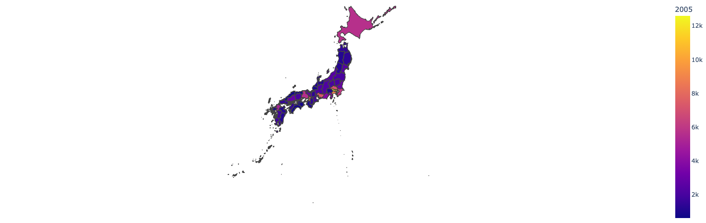

# Japanese Population Visualization

This is a simple visualization of the population data of Japanese prefectures over different years using a choropleth map. The visualization is built using Dash and Plotly.

